# mongodb-udemy

this is tutorial about mongodb from udemy

# 0 My Requirement

1. jira-id must be unique, how to set this as unique?

# 0 Sample Query

<br>

## 0.1 find year month count sort
```js
// https://www.mongodb.com/docs/manual/reference/operator/aggregation/sort/
db.PPBLRAC.aggregate([
  {
    $group: {
      _id: {
        year: {
          $year: {
            $dateFromString: {
              dateString: '$jiraCreatedAt',
            },
          },
        },
        month: {
          $month: {
            $dateFromString: {
              dateString: '$jiraCreatedAt',
            },
          },
        },
      },
      count: { $sum: 1 },
    },
  },
  {
    $sort: { _id: -1 },
  },
])
```

<br>

## 0.2 find reason
```js
// https://www.mongodb.com/docs/manual/core/aggregation-pipeline/
db.PPBLRAC.aggregate([
  {
    $group: { _id: '$resolutionReason', count: { $sum: 1 } },
  },
])
```

<br>

## 0.3 config setup 
```js
// display more records
config.set("displayBatchSize", 300)

config.set("displayBatchSize", 20)
```


# 0 Tips

## Docker MongoDB

```bash
# 1. pull image
$ docker pull mongo

# 2. start container
# 2.1
$ docker run -d -p 27018:27017 --name mongo_docker-server -d mongo:latest

# 2.2
$ docker run --name mongo_docker-server -v /my/custom:/etc/mongo -d mongo --config /etc/mongo/mongod.conf

# 2.3
$ docker run -d --network some-network --name mongo_docker-server \
	-e MONGO_INITDB_ROOT_USERNAME=mongoadmin \
	-e MONGO_INITDB_ROOT_PASSWORD=secret \
	mongo

# 3. interact with bash inside container
$ docker exec -it mongo_docker-server bash
>> mongosh

$ docker logs mongo_docker-server
```

## References

| Key                                     | value                                                             |
| --------------------------------------- | ----------------------------------------------------------------- |
| --fork                                  | let mongo server run in deamon mode                               |
| default mongodb port                    | 27017                                                             |
| $set:{}                                 | $ reserve for operator                                            |
| $gt: 0                                  | $ greater than                                                    |
|                                         | document order by \_id in ascending order                         |
| kill 18888                              | 关闭 server 进程 <br> 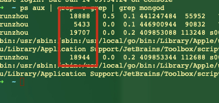 |
| `ps aux \| grep -v grep \| grep mongod` | display mongodb server process                                    |
|                                         |                                                                   |
|                                         |                                                                   |
|                                         |                                                                   |
|                                         |                                                                   |
| MongoDB drivers                         | https://www.mongodb.com/docs/drivers/                             |
| MongoDB official tutorial               | https://www.mongodb.com/docs/manual/tutorial/getting-started/     |
| BSON types                              | https://www.mongodb.com/docs/manual/reference/bson-types/         |
|                                         |                                                                   |
|                                         |                                                                   |
|                                         |                                                                   |

`mongodb shell cmds`

| Key      | value        |
| -------- | ------------ |
| cls      | clean screen |
| show dbs |              |

## Errors

1. cannnot restart mongodb server

```bash
# (1) delete data/*.lock file
# https://blog.csdn.net/guo_qiangqiang/article/details/88105449
$ rm WiredTiger.lock mongod.lock

# (2) restart server, you have to bind db path. default is /usr/local/var/mongodb
mongod --dbpath /Users/runzhou/git/mongodb-udemy/mongodb/data --logpath /Users/runzhou/git/mongodb-udemy/mongodb/logs/mongo.log --fork

```

# 1 Intro

<br><br><br>

## 1.1 what is Mongodb?

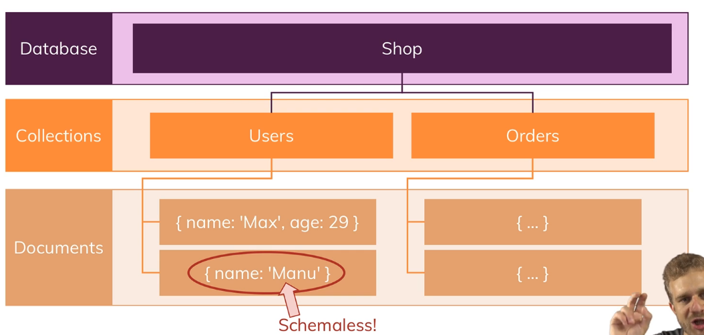

1. humongous - Because it can store lots and lots of data

2. How it works
   JSON(BSON - Binary version) Data format

```json
{
    "name": "Max",
    "age": 29,
    "address":
        {
            "city":"Minuch"
        },
    "hobbies"[
        {"name": "Cooking"},
        {"name": "Sports"}
    ]
}

```

3. BSON data structure. NoSQL

   (1) no Schema!

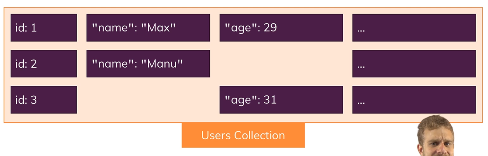

    (2) no/ few relations


4. MongoDB Ecosystem


<br><br><br>

## 1.2 Setup mongodb

[mongodb](https://www.mongodb.com/)

```bash
# (1) download community sever
https://www.mongodb.com/try/download/community

# (2) unzip
$ tar -zxvf mongodb-macos-x86_64-6.0.3.tgz

# (3) copy binaries into /usr/local/bin
$ sudo cp /Users/runzhou/git/mongodb-udemy/mongodb-macos-x86_64-6.0.3/bin/* /usr/local/bin

# (4) create symbolic linkx
$ sudo ln -s /Users/runzhou/git/mongodb-udemy/mongodb-macos-x86_64-6.0.3/bin/* /usr/local/bin

# (5) create data and logs folder
$ cd /Users/runzhou/git/mongodb-udemy
$ mkdir -p mongodb/data
$ mkdir -p mongodb/logs

# (6) link data and logs folder with mongod
$ mongod --dbpath /Users/runzhou/git/mongodb-udemy/mongodb/data --logpath /Users/runzhou/git/mongodb-udemy/mongodb/logs/mongo.log --fork

# (6) valid mongod server status
$ ps aux | grep -v grep | grep mongod

# (7) install mongosh
# https://www.mongodb.com/docs/mongodb-shell/install/#std-label-mdb-shell-install
$ brew install mongosh
# check mongodb port
$ netstat -nap tcp | grep -i "listen"

# (8) start mongo shell
$ mongosh
>> show dbs

# (9) you can connect with a non-default port
$ mongosh "mongodb://localhost:28015"
# OR
$ mongosh --port 28015

# (10) install mongodb-database-tools
# https://www.mongodb.com/docs/database-tools/installation/installation-macos/

# Tap the MongoDB formula
$ brew tap mongodb/brew
# install tools
$ brew install mongodb-database-tools
# upgrade tools
$ brew upgrade mongodb-database-tools
```

<br><br><br>

## 1.3 Get start with mongodb

```bash
# 1. switch db
$  use shop
>> switched to db shop

# 2. add new row
# for key you don't need add "", but you can keep it also
$ db.products.insertOne({name:"A Book", price: 12.99})
>>{
  acknowledged: true,
  insertedId: ObjectId("63c1001afb19689e8d76eeb3")
}


# 3. find row
# return all data in this collection
$ db.products.find()
>>[
  {
    _id: ObjectId("63c1001afb19689e8d76eeb3"),
    name: 'A Book',
    price: 12.99
  }
]

# 4. prettier
$ db.products.find().pretty()
>>[
  {
    _id: ObjectId("63c1001afb19689e8d76eeb3"),
    name: 'A Book',
    price: 12.99
  }
]


# 5. add another row
$ db.products.insertOne({
    "name": "Max",
    "age": 29,
    "address":
        {
            "city":"Minuch"
        },
    "hobbies":[
        {"name": "Cooking"},
        {"name": "Sports"}
    ]
})

```

## 1.4 mongodb drivers to different languages

[drivers](https://www.mongodb.com/docs/drivers/java-drivers/)

## 1.5 mongodb big picture

1. mongodb workflow

engine: WiredTiger


2. data layer

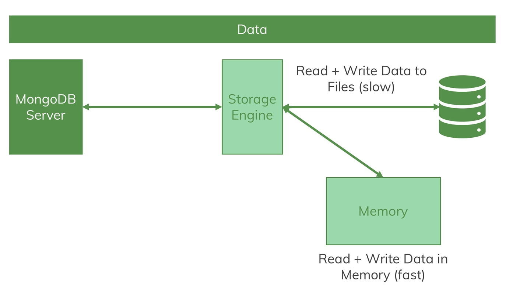

<br><br><br>

## 1.6 mongodb course outline

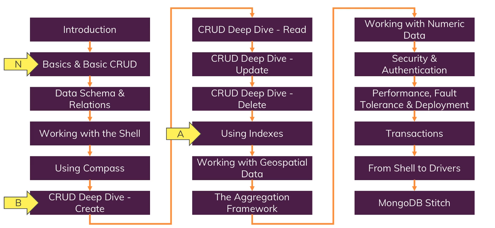


<br><br><br>

# 2. Basic & CRUD

1. Basics about collections & Documents
2. Basic Data types
3. Performing CRUD operations

<br><br><br>

## 2.1 Basic

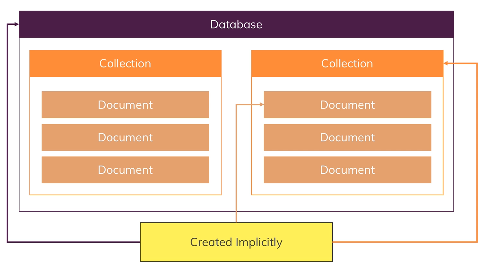

### 2.1.1 Json data types

1. json type:
   array, object, string, number, boolean

2. JSON vs BSON

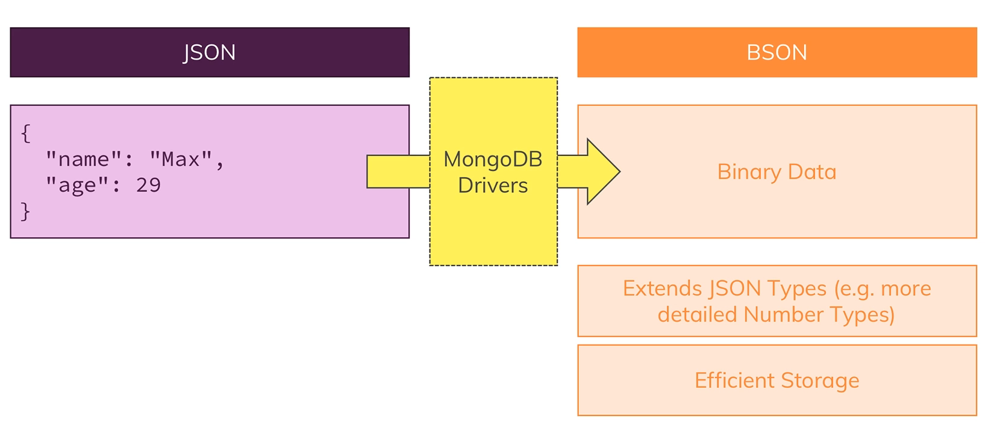

### 2.1.2 Interaction with mongodb

```bash
# 1. start mongodb
$ sudo mongod --fork
# start in different port
$ sudo mongod --port 27018 --fork

# 2. start mongo shell (if port is not default)
$ mongo --port 27018

# 3. mongodb CRUD offical doc
# https://www.mongodb.com/docs/manual/tutorial/insert-documents/

# 4. switch/creat db by `use`
# but no displayed if u dont insert data
$ use flights

# 5. insert document with collection name(equal to table in mysql)
$ db.flightData.insertOne({
    "departureAirport": "MUC",
    "arrivalAirport": "SFO",
    "aircraft": "Airbus A380",
    "distance": 12000,
    "intercontinental": true
    })

# 6. find data for this collections
$ db.flightData.find()

# 7. you can key without "", you can also add own _id but must be unique
$ db.flightData.insertOne({departureAirport: "TXL", arrivalAirport: "LHR"})

$ db.flightData.insertOne({departureAirport: "TXL", arrivalAirport: "LHR", _id:"xyz-001-k5n"})
# but you cannot add row with same _id
# MongoServerError: E11000 duplicate key error collection: flights.flightData index: _id_ dup key: { _id: "xyz-001-k5n" }

```

## 2.2 CRUD

<br><br><br>

### 2.2.1 CRUD operations & MongoDB


<br><br><br>

### 2.2.2 CRUD Operations

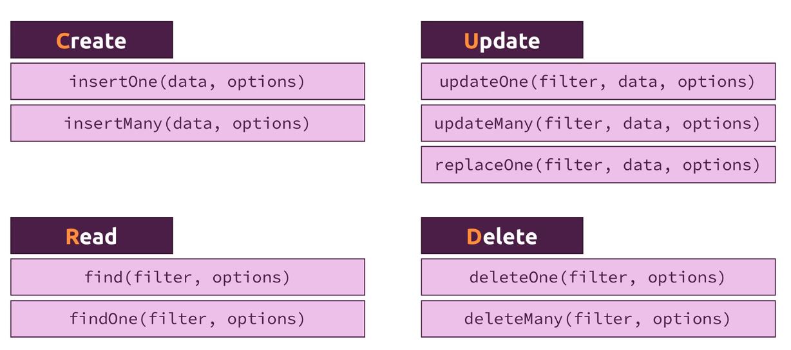

1. Create

```bash
insertOne(data, options)
insertMany(data, options)
```

2. Read

```bash
find(filter, options)
findOne(filter, options)
# get first data
```

3. Update

```bash
updateOne(filter, data, options)
updateMany(filter, data, options)
replaceOne(filter, data, options)
```

4. Delete

```bash
deleteOne(filter, options)
deleteMany(filter, options)
```

<br><br><br>

### 2.2.3 Finding, Inserting, Deleting & Updating Elements

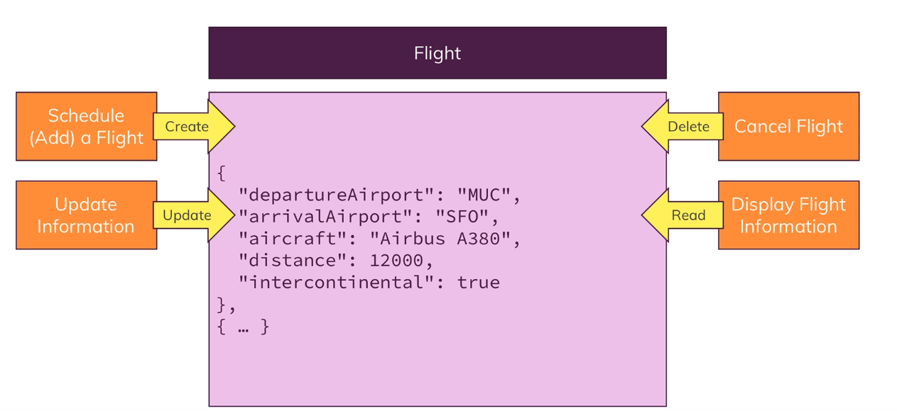

```bash
# 1. insert Many
db.flightData.insertMany([
    {
        "departureAirport": "MUC",
        "arrivalAirport": "SFO",
        "aircraft": "Airbus A380",
        "distance": 12000,
        "intercontinental": true
    },
    {
        "departureAirport": "LHR",
        "arrivalAirport": "TXL",
        "aircraft": "Airbus A320",
        "distance": 950,
        "intercontinental": false
    }
])

# id will be in order
>>{
  acknowledged: true,
  insertedIds: {
    '0': ObjectId("63c16d05bac11b5d1bfac792"),
    '1': ObjectId("63c16d05bac11b5d1bfac793")
  }
}

# 2. update one/ many
$ db.flightData.updateOne({distance: 12000}, {$set: {marker: "delete"}})
>>{
  acknowledged: true,
  insertedId: null,
  matchedCount: 1,
  modifiedCount: 1,
  upsertedCount: 0
}

$ db.flightData.updateMany({}, {$set: {maker: "toDelete"}})
# this will change all data in flightData collection (the table)
>>{
  acknowledged: true,
  insertedId: null,
  matchedCount: 2,
  modifiedCount: 2,
}

# 3. delete one
$ db.flightData.deleteOne({departureAirport: "TXL"})
# delete the first data satisfy the condition


# 4. delete all
$ db.flightData.deleteMany({})
# filter is None, then every document matches, all will be deleted

# delete by filter(condition)
$ db.flightData.deleteMany({maker: "toDelete"})


# 5. Find data
# find document with filter
$ db.flightData.find({arrivalAirport: "SFO"})

# $gt greater than
$ db.flightData.find({distance: {$gt: 0}})


$ db.flightData.findOne({distance: {$gt: 900}})
# return the first matching element
>>{
  _id: ObjectId("63c16f2ebac11b5d1bfac794"),
  departureAirport: 'MUC',
  arrivalAirport: 'SFO',
  aircraft: 'Airbus A380',
  distance: 12000,
  intercontinental: true
}

# 6. update vs updateMany()
# update/ insert (if not exist) column delayed into _id =xxxx document
$ db.flightData.updateOne({_id: ObjectId("63c16f2ebac11b5d1bfac794")}, {$set: {delayed: true}})

# if no `$SET`, updateOne or updateMany  or update will fail. MUST ADD $set
flights> db.flightData.updateOne({_id: ObjectId("63c16f2ebac11b5d1bfac794")}, {delayed: true})
>> MongoInvalidArgumentError: Update document requires atomic operators
flights> db.flightData.updateMany({_id: ObjectId("63c16f2ebac11b5d1bfac794")}, {delayed: true})
>> MongoInvalidArgumentError: Update document requires atomic operators
flights> db.flightData.update({_id: ObjectId("63c16f2ebac11b5d1bfac794")}, {delayed: true})
MongoInvalidArgumentError: Update document requires atomic operators


# use replaceOne() to override document
$ db.flightData.replaceOne({_id: ObjectId("63c16f2ebac11b5d1bfac794")}, {delayed: true})

# before
  {
    _id: ObjectId("63c16f2ebac11b5d1bfac794"),
    departureAirport: 'MUC',
    arrivalAirport: 'SFO',
    aircraft: 'Airbus A380',
    distance: 12000,
    intercontinental: true,
    delayed: true
  }
# after
{ _id: ObjectId("63c16f2ebac11b5d1bfac794"), delayed: true }


# 7. find()
# return you a cusor when beyond 20 documents
$ db.passengers.find()


# return all your documents
$ db.passengers.find().toArray()

# forEach cmd. find each data one by one, not load them all
$ db.passengers.find().forEach((passengerData) => {printjson(passengerData)})
```

<br><br><br>

### 2.2.4 Projection

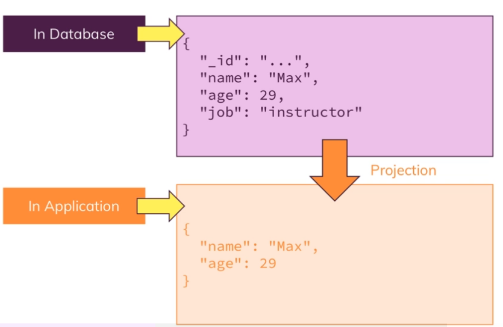

help filter some unecessary column

`0` excluded
`1` included

```bash
# included it in the data when u're returning to me
# _id is always included
$ db.passengers.find({}, {name: 1}).pretty()

# we can remove _id as well
$ db.passengers.find({}, {name: 1, _id: 0}).pretty()
```

<br><br><br>

### 2.2.5 Embedded Documents


<br><br><br>

#### 2.2.5.1 embeded documents

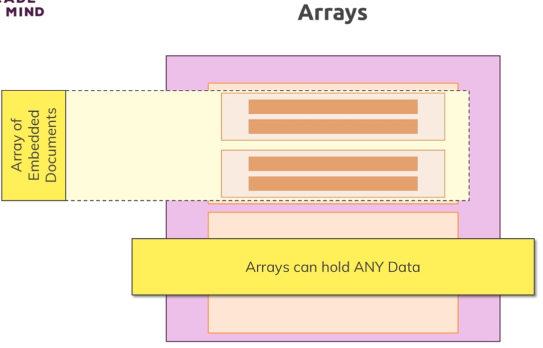

```bash
# embedded documents
$ db.flightData.updateMany({}, {$set: {status: {description: "on-time", lastUpdated: "1 hour ago"}}})
>>
[
  {
    _id: ObjectId("63c16f2ebac11b5d1bfac794"),
    departureAirport: 'MUC',
    arrivalAirport: 'SFO',
    aircraft: 'Airbus A380',
    distance: 12000,
    intercontinental: true,
    status: { description: 'on-time', lastUpdated: '1 hour ago' }
  },
  {
    _id: ObjectId("63c16f2ebac11b5d1bfac795"),
    departureAirport: 'LHR',
    arrivalAirport: 'TXL',
    aircraft: 'Airbus A320',
    distance: 950,
    intercontinental: false,
    status: { description: 'on-time', lastUpdated: '1 hour ago' }
  }
]

# easily to do update
$ db.flightData.updateMany({}, {$set: {status: {description: "on-time", lastUpdated: "1 hour ago", details: {responsible: "Rick Zhou"}}}})
>> [
  {
    _id: ObjectId("63c16f2ebac11b5d1bfac794"),
    departureAirport: 'MUC',
    arrivalAirport: 'SFO',
    aircraft: 'Airbus A380',
    distance: 12000,
    intercontinental: true,
    status: {
      description: 'on-time',
      lastUpdated: '1 hour ago',
      details: { responsible: 'Rick Zhou' }
    }
  },
  {
    _id: ObjectId("63c16f2ebac11b5d1bfac795"),
    departureAirport: 'LHR',
    arrivalAirport: 'TXL',
    aircraft: 'Airbus A320',
    distance: 950,
    intercontinental: false,
    status: {
      description: 'on-time',
      lastUpdated: '1 hour ago',
      details: { responsible: 'Rick Zhou' }
    }
  }
]
```

<br><br><br>

#### 2.2.5.2 array

```bash
$ db.passengers.updateOne({name: "Albert Twostone"}, {$set: {hobbies: ["sports", "cooking"]}})
>>
[
  {
    _id: ObjectId("63c174a2bac11b5d1bfac7a8"),
    name: 'Klaus Arber',
    age: 53
  },
  {
    _id: ObjectId("63c174a2bac11b5d1bfac7a9"),
    name: 'Albert Twostone',
    age: 68,
    hobbies: [ 'sports', 'cooking' ]
  }
]
```

<br><br><br>

#### 2.2.5.3 Accessing Structured Data

```bash
# findOne() to retrieve specific data
$ db.passengers.findOne({name: "Albert Twostone"}).hobbies

# find entire documents
$ db.passengers.find({hobbies: "sports"})


# if it's nested key
$ db.flightData.find({"status.description": "on-time"})
>>   {
    _id: ObjectId("63c16f2ebac11b5d1bfac795"),
    departureAirport: 'LHR',
    arrivalAirport: 'TXL',
    aircraft: 'Airbus A320',
    distance: 950,
    intercontinental: false,
    status: {
      description: 'on-time',
      lastUpdated: '1 hour ago',
      details: { responsible: 'Rick Zhou' }
    }
  }


$ db.flightData.find({"status.details.responsible": "Rick Zhou"})
```

<br><br><br>

## 2.3 Summary

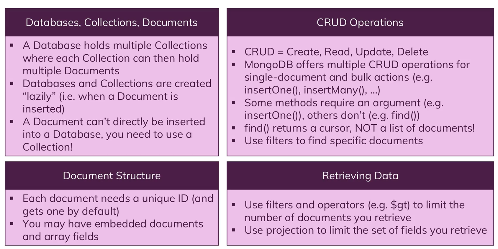

<br><br><br>

# 3. schemas & Relations: How to structure Documents

1. Understanding Document Schemas & Data Types
2. Modelling Relations
3. Schema Validation

[MongoDB limits](https://www.mongodb.com/docs/manual/reference/limits/)<br>
[MongoDB data types](https://www.mongodb.com/docs/mongodb-shell/reference/data-types/)<br>
[MongoDB schema validation](https://www.mongodb.com/docs/manual/core/schema-validation/)<br>

```bash
# 1. drop db
$ show dbs
$ use shop
$ db.dropDatabase()

# 2. drop collection
$ show collections
$ db.myCollection.drop()
```

<br><br><br>

## 3.1 Understanding Document Schemas & Data Types

schemas means the structure documents. MongoDB is schemaless. MongoDB enforces no schemas!

Documents don't have to use the same schema inside of one collection ==> but you can still use schema

<br><br><br>

### 3.1.1 structuring documents

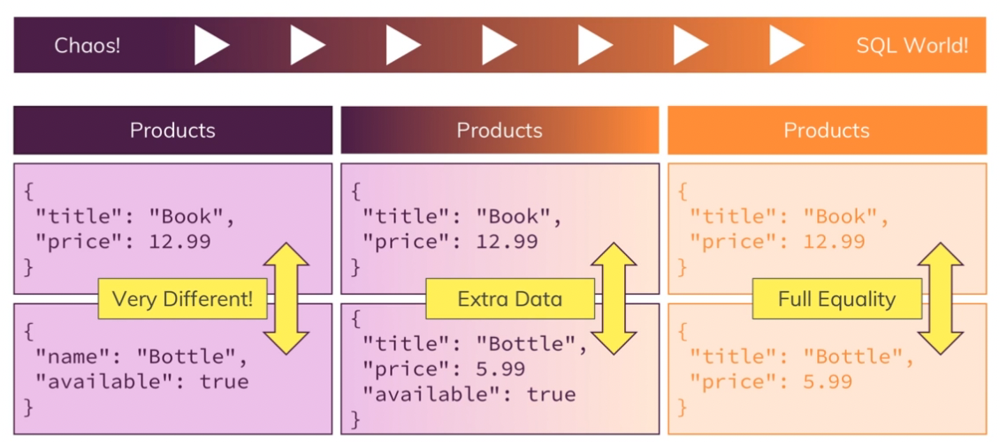

<br><br><br>

```bash
# 1. differnt structure
$ db.products.insertOne({name: "A book", price: 12.99})
$ db.products.insertOne({name: "A T-shirt", price: 24.99})
$ db.products.insertOne({name: "A Computer", price: 2499.99, details: {cpu: "Intel i7 8770"}})

# 2. force to be the same structure
$ db.products.insertOne({name: "A book", price: 12.99, details: null})
$ db.products.insertOne({name: "A T-shirt", price: 24.99, details: null})
$ db.products.insertOne({name: "A Computer", price: 2499.99, details: {cpu: "Intel i7 8770"}})
```

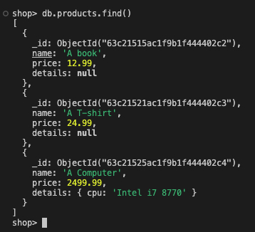

### 3.1.2 Data Types


default number value is `float64`

```bash
# 1. multiple data types
$ use test
$ db.dropDatabases()

$ use companyData

$ db.companies.insertOne({name: "Fresh Apples Inc", isStartup: true, employees: 33, funding: 12345678901234567890, details: {ceo: "Rick Zhou"}, tags: [{title: "super"}, {title: "perfect"}], foundingDate: new Date(), insertedAt: new Timestamp()})

$ db.companies.findOne()

# the funding is different, too big, out of range
Expected: 12345678901234567890
Actual:   12345678901234567000

# 2. numbers
$ db.stats()
>>{
  db: 'companyData',
  collections: 2,
  views: 0,
  objects: 2,
  # avgObjSize: 130,
  # dataSize: 260,
  storageSize: 24576,
  indexes: 2,
  indexSize: 24576,
  totalSize: 49152,
  scaleFactor: 1,
  fsUsedSize: 414552260608,
  fsTotalSize: 494384795648,
  ok: 1
}

$ db.companies.drop()
$ db.stats()
>>{
  db: 'companyData',
  collections: 1,
  views: 0,
  objects: 1,
  # avgObjSize: 29,
  # dataSize: 29,
  storageSize: 20480,
  indexes: 1,
  indexSize: 20480,
  totalSize: 40960,
  scaleFactor: 1,
  fsUsedSize: 414554734592,
  fsTotalSize: 494384795648,
  ok: 1
}

$ db.numbers.deleteMany({})
$ db.stats()
>> {
  db: 'companyData',
  collections: 1,
  views: 0,
  objects: 0,
  avgObjSize: 0,
  dataSize: 0,
  storageSize: 20480,
  indexes: 1,
  indexSize: 20480,
  totalSize: 40960,
  scaleFactor: 1,
  fsUsedSize: 414556864512,
  fsTotalSize: 494384795648,
  ok: 1
}

$ db.numbers.insertOne({a: NumberInt(1)}) # in int64
$ db.stats()
>> {
  db: 'companyData',
  collections: 1,
  views: 0,
  objects: 1,
  avgObjSize: 29,
  dataSize: 29,
  storageSize: 36864,
  indexes: 1,
  indexSize: 36864,
  totalSize: 73728,
  scaleFactor: 1,
  fsUsedSize: 414557216768,
  fsTotalSize: 494384795648,
  ok: 1
}

# check type
$ typeof db.numbers.findOne().a
>> number
```

#### Limits

[MongoDB limits and thresholds](https://www.mongodb.com/docs/manual/reference/limits/)<br>

1. a single document cannot larger than 16mb
2. no more than 100 nested level
3. NumberInt => int32, NumberLong => int64<br>


<br><br><br>

## 3.2 Modelling Relations

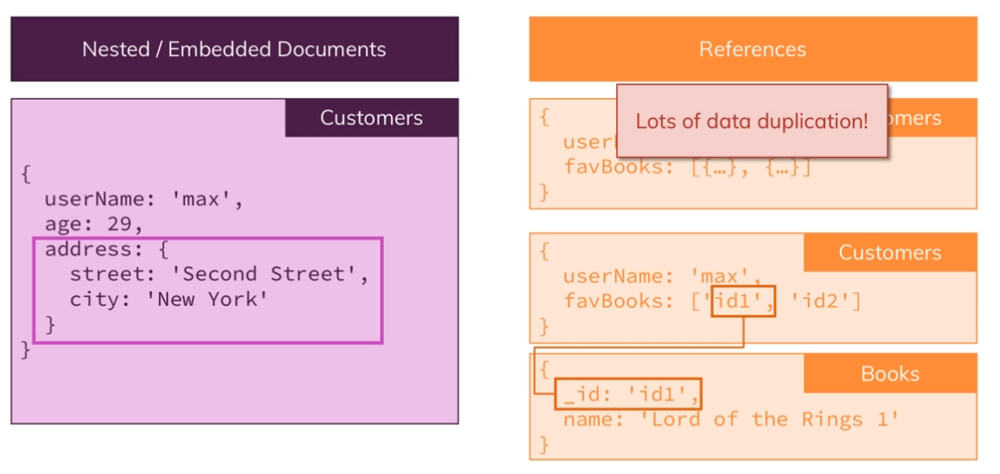

<br><br><br>

### 3.2.1 Requirements

<br><br><br>

### 3.2.2 Relations

<br><br><br>

#### 3.2.2.1 One to one relations - Embedded

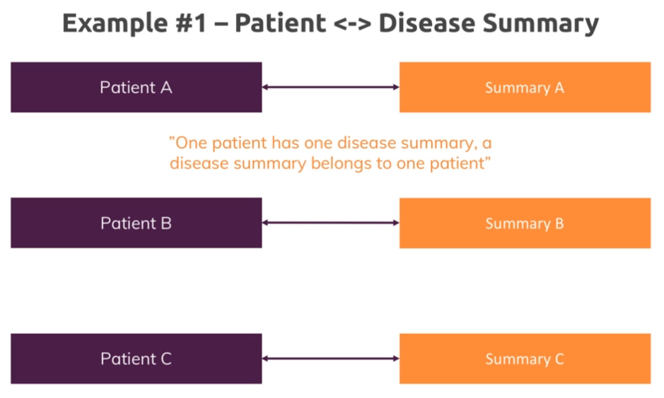

```bash
# when you have strong one-to-one realtion, you can just embedded your object
db.patients.insertOne({name: "Rick", age: 29, diseaseSummary: {diseases: ["cold", "borken leg"]}})
```

#### 3.2.2.2 one to one - using references

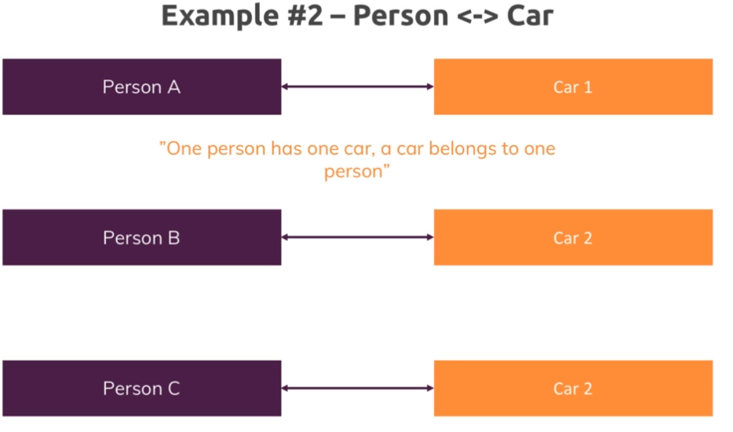

```bash
# you can add first _id to 2nd collection
$ db.persons.insertOne({name: "Rick", age: 29, salary: 3000})

$ db.cars.insertOne({model: "BMW", price: 40000, owner: ObjectId("63c2c34a05122ca3240abd9b")})

```

<br><br><br>

#### 3.2.2.3 one to many - embedded

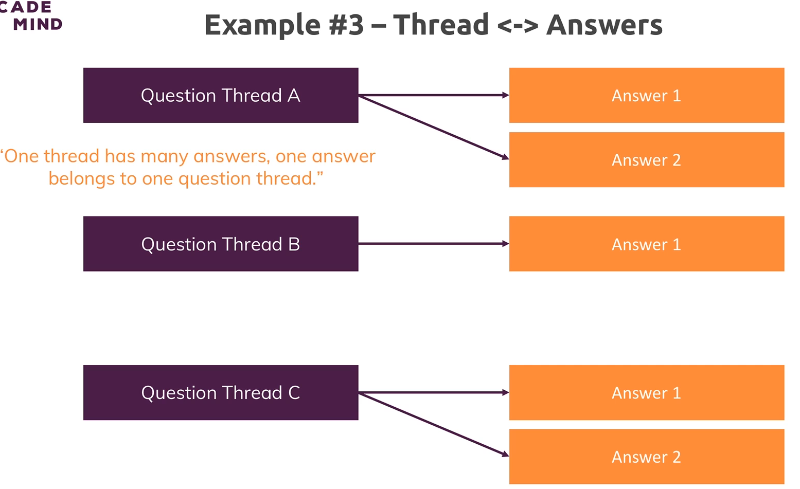

<br><br><br>

#### 3.2.2.4 one to many - using references

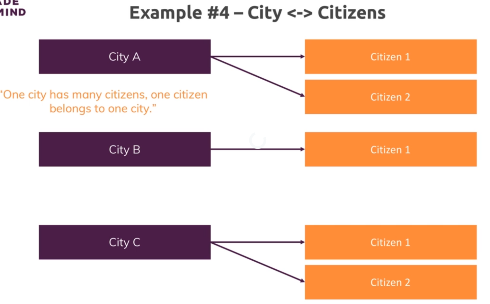

<br><br><br>

#### 3.2.2.5 many to many - embedded

1. for order once customer paid it, we dont need care about product change. Order will just record the status at that moment<br>
   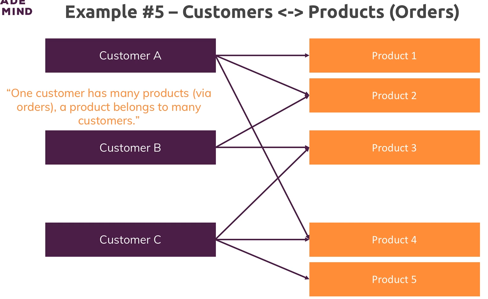

<br><br><br>

#### 3.2.2.6 many to many - using references

1. if the reference collection data will change often, we better use reference. In case of updating all collections with same data

```bash
$ db.books.updateOne({}, {$set: {author: [ObjectId("63c2cfc205122ca3240abda6"), ObjectId("63c2cfc205122ca3240abda7")]}})
```

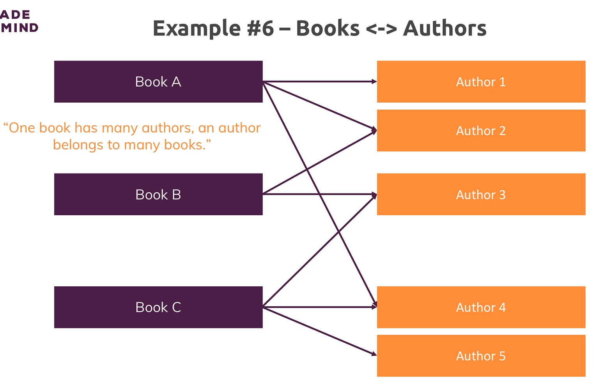

<br><br><br>

#### 3.2.2.7 relations summary

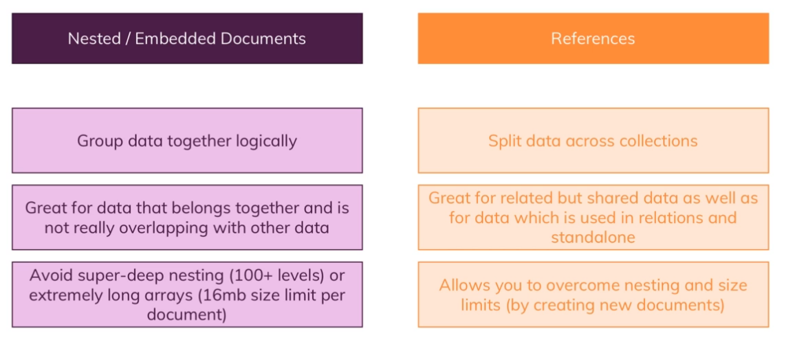

<br><br><br>

#### 3.2.2.8 $lookUp()

```bash
# 1. remove a field $unset
$ db.books.updateOne({}, {$unset: {author: ""}})

# (1) from which collection (2) what is the field linking in current collection (3) what is the foreign collection's field to map  (4) what is the new field name
$ db.books.aggregate([{$lookup: {from: "authors", localField: "authors", foreignField: "_id", as: "creators"}}])
>> [
  {
    _id: ObjectId("63c2cf7805122ca3240abda5"),
    name: 'My favorite book',
    authors: [
      ObjectId("63c2cfc205122ca3240abda6"),
      ObjectId("63c2cfc205122ca3240abda7")
    ],
    creators: [
      {
        _id: ObjectId("63c2cfc205122ca3240abda6"),
        name: 'Rick Zhou',
        age: 29,
        address: { street: 'Main' }
      },
      {
        _id: ObjectId("63c2cfc205122ca3240abda7"),
        name: 'Eve Baby',
        age: 18,
        address: { street: 'Forest' }
      }
    ]
  }
]
```

<br><br><br>

#### 3.2.2.9 Example

```bash
# 1. Post have 1 creator but cooments can have mutiple different creators
$ db. users.insertMany([{name: "Rick Zhou", age: 25, email: "rickzhou@email.com"},{name: "Eve Baby", age: 18, email: "evebaby@email.com"}])

$  db.posts.insertOne({title: "My first Post!", description: "This is my first post, hope u like it!", tags: ["new", "tech"], creator: ObjectId("63c2d9e005122ca3240abda8"), comments: [{text: "I like this!", author: ObjectId("63c2d9e005122ca3240abda9")}] })
```

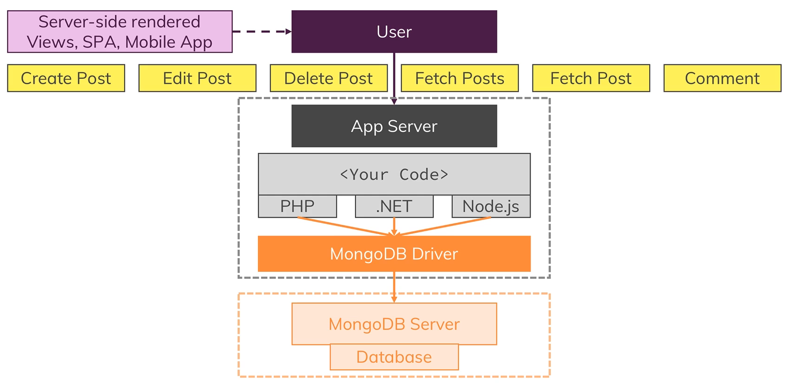
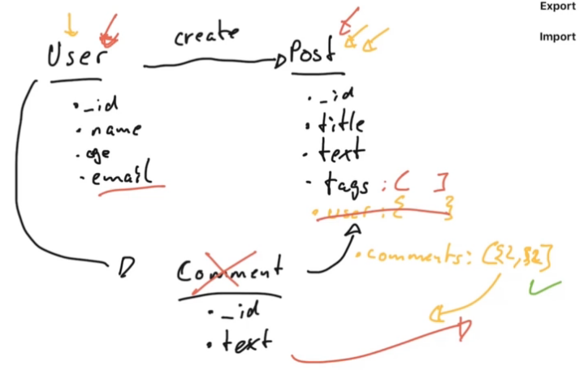

<br><br><br>

## 3.3 Schema Validation

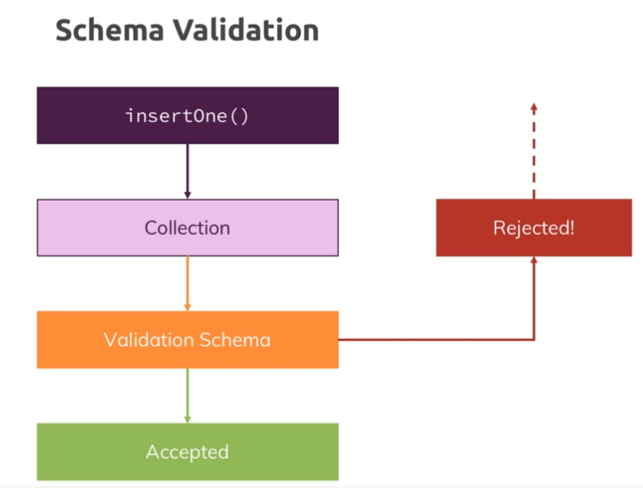


<br><br><br>

## 3.3.1 Adding collection document validation

```bash
# "post"    - the collection you want to add validation
# bsonType  -
# required  - required fields in request


db.createCollection("posts", {
    validator: {
        $jsonSchema: {
            bsonType: "object",
            required: ["title", "description", "creator", "comments"],
            properties: {
                title: {
                    bsonType: "string",
                    description: "must be a string and is required"
                },
                description: {
                    bsonType: "string",
                    description: "must be a string and is required"
                },
                creator: {
                    bsonType: "objectId",
                    description: "must be a objectId and is required"
                },
                comments: {
                    bsonType: "array",
                    description: "must be a array and is required",
                    items: {
                        bsonType: "object",
                        required: ["text", "author"],
                        properties: {
                            text: {
                                bsonType: "string",
                                description: "must be a string and is required"
                            },
                            author: {
                                bsonType: "objectId",
                                description: "must be a objectId and is required"
                            }
                        }
                    }
                }
            }
        }
    }
});


# if missing some fields
$ db.posts.insertOne({title: "My first Post!", description: "This is my first post, hope u like it!", tags: ["new", "tech"], creator: ObjectId("63c2d9e005122ca3240abda8"), comments: [{text: "I like this!", author: ObjectId("63c2d9e005122ca3240abda9")}] })
>> Uncaught:
MongoServerError: Document failed validation
Additional information: {
  failingDocumentId: ObjectId("63c2df3505122ca3240abdab"),
  details: {
    operatorName: '$jsonSchema',
    schemaRulesNotSatisfied: [
      {
        operatorName: 'required',
        specifiedAs: { required: [ 'title', 'text', 'creator', 'comments' ] },
        missingProperties: [ 'text' ]
      }
    ]
  }
}
```

<br><br><br>

## 3.3.2 changing the validation action

```bash
# collMod   - collection modifier
db.runCommand({
    collMod: "posts",
    validator: {
      ....
    },
    validationAction: "warn"
});

# insert a invalid document
$ db.posts.insertOne({ title: "My first Post!", description: "This is my first post, hope u like it!", tags: ["new", "tech"], creator: ObjectId("63c2d9e005122ca3240abda8"), comments: [{ text: "I like this!", author: 12 }] })

# insertion will be successful, but will post warn log in our log file (mongo.log)

```

<br><br><br>

## 3.4 Wrapup

<br><br><br>

### 3.4.1 Data Modelling & Structuring - Things to consider


<br><br><br>

### 3.4.2 Module Summary


<br><br><br>

# 4.

<br><br><br>
<br><br><br>
<br><br><br>
<br><br><br>
<br><br><br>
<br><br><br>
<br><br><br>
<br><br><br>
<br><br><br>
