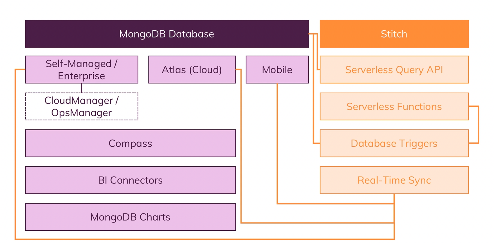

# mongodb-udemy

this is tutorial about mongodb from udemy

# 0 Tips

| Key                  | value                               |
| -------------------- | ----------------------------------- |
| --fork               | let mongo server run in deamon mode |
| default mongodb port | 27017                               |

`mongodb shell cmds`

| Key      | value        |
| -------- | ------------ |
| cls      | clean screen |
| show dbs |              |

# 1 Intro

<br><br><br>

## 1.1 what is Mongodb?


1. humongous - Because it can store lots and lots of data

2. How it works
   JSON(BSON - Binary version) Data format

```json
{
    "name": "Max",
    "age": 29,
    "address":
        {
            "city":"Minuch"
        },
    "hobbies"[
        {"name": "Cooking"},
        {"name": "Sports"}
    ]
}

```

3. BSON data structure. NoSQL

   (1) no Schema!


    (2) no/ few relations


4. MongoDB Ecosystem



<br><br><br>

## 1.2 Setup mongodb

[mongodb](https://www.mongodb.com/)

```bash
# (1) download community sever
https://www.mongodb.com/try/download/community

# (2) unzip
$ tar -zxvf mongodb-macos-x86_64-6.0.3.tgz

# (3) copy binaries into /usr/local/bin
$ sudo cp /Users/runzhou/git/mongodb-udemy/mongodb-macos-x86_64-6.0.3/bin/* /usr/local/bin

# (4) create symbolic linkx
$ sudo ln -s /Users/runzhou/git/mongodb-udemy/mongodb-macos-x86_64-6.0.3/bin/* /usr/local/bin

# (5) create data and logs folder
$ cd /Users/runzhou/git/mongodb-udemy
$ mkdir -p mongodb/data
$ mkdir -p mongodb/logs

# (6) link data and logs folder with mongod
$ mongod --dbpath /Users/runzhou/git/mongodb-udemy/mongodb/data --logpath /Users/runzhou/git/mongodb-udemy/mongodb/logs/mongo.log --fork

# (6) valid mongod server status
$ ps aux | grep -v grep | grep mongod

# (7) install mongosh
# https://www.mongodb.com/docs/mongodb-shell/install/#std-label-mdb-shell-install
$ brew install mongosh
# check mongodb port
$ netstat -nap tcp | grep -i "listen"

# (8) start mongo shell
$ mongosh
>> show dbs

# (9) you can connect with a non-default port
$ mongosh "mongodb://localhost:28015"
# OR
$ mongosh --port 28015

# (10) install mongodb-database-tools
# https://www.mongodb.com/docs/database-tools/installation/installation-macos/

# Tap the MongoDB formula
$ brew tap mongodb/brew
# install tools
$ brew install mongodb-database-tools
# upgrade tools
$ brew upgrade mongodb-database-tools
```

<br><br><br>

## 1.3 Get start with mongodb

```bash
# 1. switch db
$  use shop
>> switched to db shop

# 2. add new row
# for key you don't need add "", but you can keep it also
$ db.products.insertOne({name:"A Book", price: 12.99})
>>{
  acknowledged: true,
  insertedId: ObjectId("63c1001afb19689e8d76eeb3")
}


# 3. find row
# return all data in this collection
$ db.products.find()
>>[
  {
    _id: ObjectId("63c1001afb19689e8d76eeb3"),
    name: 'A Book',
    price: 12.99
  }
]

# 4. prettier
$ db.products.find().pretty()
>>[
  {
    _id: ObjectId("63c1001afb19689e8d76eeb3"),
    name: 'A Book',
    price: 12.99
  }
]


# 5. add another row
$ db.products.insertOne({
    "name": "Max",
    "age": 29,
    "address":
        {
            "city":"Minuch"
        },
    "hobbies":[
        {"name": "Cooking"},
        {"name": "Sports"}
    ]
})

```

## 1.4 mongodb drivers to different languages

[drivers](https://www.mongodb.com/docs/drivers/java-drivers/)

## 1.5 mongodb big picture

1. mongodb workflow

engine: WiredTiger


2. data layer
   

<br><br><br>

## 1.6 mongodb course outline


<br><br><br>
